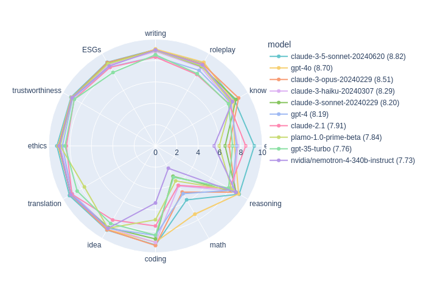

# pfmt-bench-fin-ja: Preferred Multi-turn Benchmark for Finance in Japanese

This is a benchmark measuring the generation quality of LLMs for financial conversations in Japanese. The benchmark consists of 360 dialogues, each containing 2 turns. There are 12 types of tasks, writing, roleplay, knowledge, extraction, reasoning, math, coding, idea, translation, ethics, trustworthiness, and ESGs.
This benchmark aims to evaluate the generation quality of LLMs in financial conversations in Japanese.

Originally, [MT-bench](https://github.com/lm-sys/FastChat/tree/main/fastchat/llm_judge) contains writing, roleplay, reasoning, math, coding, extraction, STEM, and humanities tasks.
Instead of STEM and humanities tasks, we added knowledge task for financial conversations.
In addition, we also newly employed idea, translation, ethics, trustworthiness, and ESGs tasks.

The evaluation is carried out with a 10-grade scale, and the evaluation is done by gpt-4o.

</img>

## How to use
The usages are almost the same as [MT-bench](https://github.com/lm-sys/FastChat/tree/main/fastchat/llm_judge)

1. set the environmental variable using `.env` file
2. generate models' answers:
```
# for HF models
python gen_model_answers.py --model-path rinna/nekomata-7b rinna/nekomata-7b-instruction ...
# for api models (currently, openai, anthropic are supported)
python gen_api_answer.py --model gpt-35-turbo --parallel 10
```
For `gen_model_answers.py`, you can set `----disable-strict-injection-check` to disable strict injection check.
The strict injection check is a function that checks whether the model's answer contains the generated next questions and answers, which could be a problem when the model outputs are evaluated in the next step.
If you do not use this option (default), the output contains the special marker for Q&A, such as `###ユーザー` and `###アシスタント`, will be removed.

3. generate judgments using gpt-4o:
```
# highly recommeded to evaluate model using single mode
python gen_judgment.py [--model-list gpt-35-turbo rinna/nekomata-7b-instruction] --mode single --parallel 10
# for pairwise evaluation (not recommended because a lot of requests are required)
python gen_judgment.py [--model-list gpt-35-turbo rinna/nekomata-7b-instruction] --mode pairwise-all --parallel 10
```
If you don't set model-list, all models generating answers are evaluated.

4. getting aggregated results:
```
python make_leaderboard.py
```
for getting aggregated results, which contain scores of each task.
```
python show_result.py
```
for calculating the results of each task on each turn.

# Citation
TBD.
```
@misc{Hirano2024-pfmt
    title={{pfmt-bench-fin-ja: Preferred Multi-turn Benchmark for Finance in Japanese}},
    author={Masanori Hirano and Kentaro Imajo},
    year={2024},
    url = {https://github.com/pfnet-research/pfmt-bench-fin-ja}
}
```

# Contribution
This project is created by [Masanori Hirano](https://mhirano.jp) and [Kentaro Imajo](https://imoz.jp/), owned by [Preferred Networks](https://www.preferred.jp) and maintained by [Masanori Hirano](https://mhirano.jp).

# Note
Models that are tuned based on this benchmark should not be evaluated by this benchmark.
For example, model merging should not be performed based on this benchmark.

# License
This benchmark code is licensed under the MIT License.
However, questions and some results files are exposed under each model's license.
